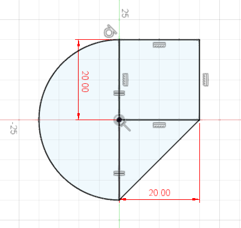

# | RedDimensions

> **_NOTE:_**  This is a proof of concept.

RedDimension is an Autodesk® Fusion 360™ add-in that changes the sketch dimensions color to be red.

As Fusion 360™ reads the file settings before the add-in can run, the changes will not have any effect until Fusion 360™ is restarted.

The add-in changes the color in all installed versions of Fusion 360™ that it can find. This hopefully makes the change apply to new versions of Fusion 360™ automatically, when you close the previous version of Fusion 360™.

## Installation
Download the add-in from the [Releases](https://github.com/thomasa88/RedDimensions/releases) page.

Unpack it into `API\AddIns` (see [How to install an add-in or script in Fusion 360](https://knowledge.autodesk.com/support/fusion-360/troubleshooting/caas/sfdcarticles/sfdcarticles/How-to-install-an-ADD-IN-and-Script-in-Fusion-360.html)).

Make sure the directory is named `RedDimensions`, with no suffix.

## Usage

Just install the add-in. It will update the settings file automatically when you restart Fusion 360™.

The add-in can be temporarily disabled using the *Scripts and Add-ins* dialog. Press *Shift+S* in Fusion 360™ and go to the *Add-Ins* tab.

### How do I change the colors back?

There is currently no built-in function to do this.

Open %localappdata%\Autodesk\webdeploy\production in Explorer. Then search for the file Photobooth.xml. The file residing in the directory *Photobooth* should be changed as follows:

From: `<SketchDimensionColor ARGB="1 1 0 0" />`

To: `<SketchDimensionColor ARGB="1 0 0 0" />`

## Known Limitations

This is a proof of concept and is barely tested.

## Author

This add-in is created by Thomas Axelsson.

I did not come up with the idea on how change the dimension color.

## License

This project is licensed under the terms of the MIT license. See [LICENSE](LICENSE).

## Changelog

* v 0.0.1
  * Initial release